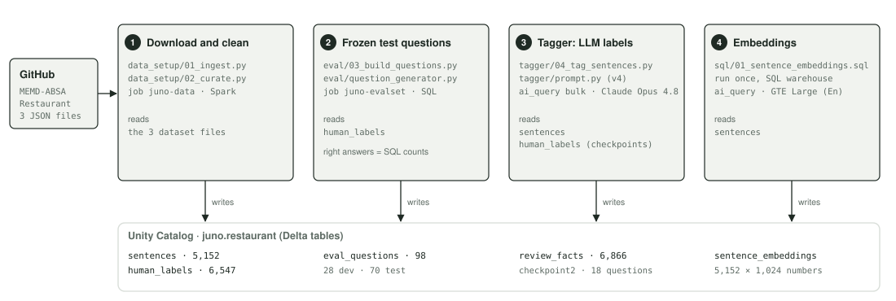
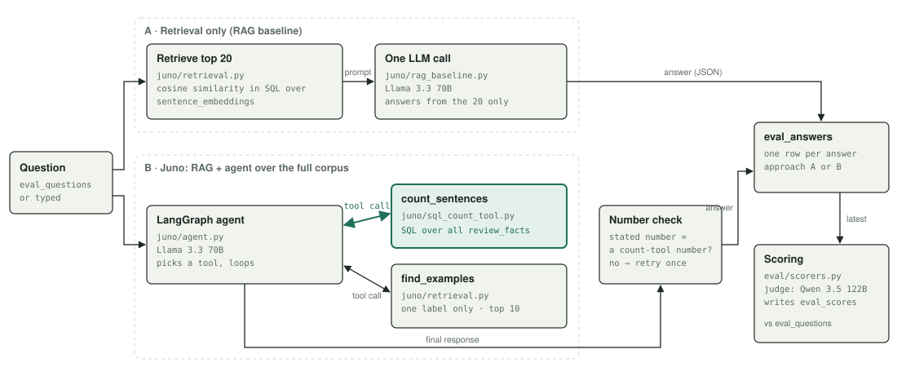

# Project Juno

Project Juno compares two ways of answering questions about customer reviews. Both use the same
retrieval over the same review sentences:

- **A. Retrieval only (RAG):** retrieves the 20 sentences closest to the question and answers from
  those alone.
- **B. RAG + agent over the full corpus (Juno):** the same retrieval, plus an agent that can query
  the whole corpus. It counts, with SQL, the labels an LLM assigned to every sentence in advance.

So the comparison is not RAG against an agent. It is answering from a retrieved sample against
answering with access to the whole corpus. Both are evaluated on the same frozen test questions.
Juno's counts are only as accurate as those labels; the results show where that limits it.

## Architecture



Four stages build the data, each run as its own Databricks job; they only talk through tables in
Unity Catalog. Stage 3 decides accuracy: Juno counts `review_facts`, the LLM's labels, not the human labels.



The highlighted edge is the whole difference: only Juno can call `count_sentences`, which counts
labels over the full corpus. Both approaches use the same model and the same scoring.

## Tech stack

| Layer | Technology | Used for |
|---|---|---|
| Platform | Azure Databricks, serverless jobs | Every notebook runs as a job; no clusters to manage |
| Deployment | Databricks CLI, Databricks Asset Bundles | Jobs defined as code in `databricks.yml` and `resources/` |
| Data | Unity Catalog, Delta tables, a volume | All tables in `juno.restaurant`; raw files in the volume |
| Bulk LLM work | `ai_query` in SQL | Labelling every review sentence; making the embeddings |
| Models | Databricks pay-per-token endpoints | Tagger: Claude Opus 4.8 · both approaches: Llama 3.3 70B Instruct · judge: Qwen 3.5 122B · embeddings: GTE Large (English) |
| Vector search | Cosine similarity in SQL | Over the `sentence_embeddings` table (the managed Vector Search service was deferred) |
| Agent | LangGraph 1.2.12, databricks-langchain | The ReAct loop and the connection to the model |
| Direct model calls | databricks-sdk | The baseline's LLM call and the judge |
| Evaluation | Own scorers and LLM judge | Results kept in `eval_answers` and `eval_scores` |
| Code quality | Python 3.12, pytest, ruff, GitHub | 105 unit tests that need no workspace |

The answering model was planned as Claude Sonnet 5 and the judge as Claude Opus 5. In this workspace
every Claude model returns "Databricks-set rate limit of 0" for real-time calls, while all eight open
chat models answered and called tools correctly (checked 2026-09-27).

## The data and its tables

The data is the public [MEMD-ABSA](https://github.com/NUSTM/MEMD-ABSA) Restaurant dataset (Cai et
al., 2023): 5,152 English sentences from restaurant reviews. People labelled each sentence with one or
more of 12 categories, such as `Service#General` or `Food#Quality`, each with a sentiment: positive,
negative or neutral. Those human labels are the right answers. A sentence can carry several labels, so
there are more labels than sentences. The dataset is downloaded at run time and never committed (it
has no licence file). Every table lives in Unity Catalog, in the schema `juno.restaurant`.

| Table | One row is | Rows |
|---|---|---|
| `sentences` | one review sentence: its id and its text | 5,152 |
| `human_labels` | one category and sentiment a person gave a sentence: the right answers | 6,547 |
| `eval_questions` | one test question, with its right answer computed from `human_labels` | 98 (28 dev, 70 test) |
| `review_facts` | one category and sentiment the LLM gave a sentence: what Juno counts | 6,866 |
| `checkpoint2` | one "how many" question: the human count, the LLM count, and whether they are within 10% | 18 |
| `sentence_embeddings` | one sentence's embedding, 1,024 numbers, used for search | 5,152 |
| `eval_answers` | one answer from either approach | 224 |
| `eval_scores` | one score for one answer on one measure, with the judge's grade for "why" answers | 288 |

Two more tables are records of the build: `raw_sentences` (the download as it came) and
`tagging_trials` (one row per labelling trial).

## The pipeline, stage by stage

Each stage is one job; the tables it writes are described above.

| Stage | Code | Runs as | Writes |
|---|---|---|---|
| 1. Download and clean | `data_setup/01_ingest.py`, `02_curate.py` | job `juno-data` | `raw_sentences`, `sentences`, `human_labels` |
| 2. Frozen test questions | `eval/03_build_questions.py`, `question_generator.py` | job `juno-evalset` | `eval_questions` |
| 3. LLM labels every sentence | `tagger/04_tag_sentences.py`, `prompt.py`, `checkpoints.py` | jobs `juno-tagging-trial`, `juno-tagging-full` | `review_facts`, `checkpoint2`, `tagging_trials` |
| 4. Embeddings | `sql/01_sentence_embeddings.sql` | one SQL statement, run once | `sentence_embeddings` |
| Answering, A or B | `eval/05_answer_questions.py` with `juno/rag_baseline.py` or `juno/agent.py` | job `juno-answers` | `eval_answers` |
| Scoring and judge | `eval/06_score_answers.py`, `scorers.py`, `judge.py` | job `juno-scores` | `eval_scores` |

The product code is in `juno/` (`categories.py`, `sql_count_tool.py`, `retrieval.py`,
`rag_baseline.py`, `agent.py`). The jobs are defined in `databricks.yml` and `resources/`; workspace
setup is in `infra/` and `sql/`; unit tests are in `tests/`.

## The two approaches

| | A. Retrieval only (RAG baseline) | B. Juno: RAG + agent over the full corpus |
|---|---|---|
| Code | `juno/rag_baseline.py` | `juno/agent.py` |
| How it answers | Vector search returns the 20 sentences closest to the question; one LLM call answers from them | A LangGraph ReAct agent: the LLM calls `count_sentences` (a fixed SQL template over the labels) and/or `find_examples` (vector search restricted to one category and sentiment, top 10) |
| Checks | none | The stated number must be one the count tool returned; otherwise one retry |
| Answering model | the same model for both (see [Tech stack](#tech-stack)) | the same |

Both return the same fields (answer text, number, unit, ranked categories, cited sentence ids), so
the same scorers apply to both. The LLM never writes SQL: categories and sentiments are chosen from
fixed allow-lists (`juno/categories.py`) and passed as query parameters.

## Results on the 70 test questions

Final run: code commit `c2ec4ca`, each approach run once on the 70 test questions, no reruns.

| Measure | Test questions | A. Retrieval only | B. Juno | Target (submitted design) |
|---|---|---|---|---|
| Count accuracy (within 10% of the true count) | 13 | 0.00 (0 of 13) | **0.38** (5 of 13) | ≥ 0.80, and ≥ 30 points above A |
| Share accuracy (within 10%) | 13 | 0.00 | 0.31 | — |
| Share within a sentiment (within 10%) | 13 | 0.00 | 0.46 | — |
| Comparison: larger category named first | 11 | 0.45 | 0.73 | — |
| Top-3 match | 6 | 0.72 | 1.00 | ≥ 0.8 |
| Citation accuracy (cited sentences carrying the human label) | 14 | 0.41 | 0.79 | ≥ 0.90 |
| Answer quality (LLM judge, 1–5) | 14 | 4.07 | 4.00 | ≥ 4 |
| Exact number (the stated number is one the count tool returned) | 39 | — | 1.00 | ≥ 0.95 |
| Median seconds per question | 70 | 5.1 | 3.0 | ≤ 15 |
| Unreadable responses | 70 | 5 | 0 | — |

**Headline: count accuracy.** Target (submitted design): at least 80% of the 13 test "how many"
questions within 10% of the true count, i.e. 11 of 13. **Result: 5 of 13 = 38%. Target missed.** Juno is 38 points above retrieval only, which gets 0 of 13, so the second condition is met. Juno got exactly the 5 questions whose tagger labels are within 10% of the human labels, and missed exactly the other 8.

**Why the target is missed: the labels, not the agent.** Juno reports the tagger's count exactly
(exact-number score above). Before Juno was built, checkpoint 2 compared the tagger's count with the
human count for every "how many" question. On 8 of the 13 test questions the tagger is more than 10%
off, so Juno cannot answer them correctly however well it works:

| Test question: how many sentences mention ... | Human count | Tagger count | Off by |
|---|---|---|---|
| the food, positively | 1,889 | 1,629 | −13.8% |
| the restaurant overall, negatively | 296 | 349 | +17.9% |
| the menu choices, positively | 229 | 395 | +72.5% |
| food prices, positively | 75 | 97 | +29.3% |
| prices, positively | 45 | 61 | +35.6% |
| food prices, negatively | 44 | 63 | +43.2% |
| other aspects of the restaurant, positively | 42 | 122 | +190.5% |
| the drinks selection, positively | 35 | 90 | +157.1% |

The ceiling the labels allow is 5 of 13 = 38%. The rule for reporting this (target fixed, reported
as missed, failing questions named) was decided on 2026-09-20, before any result existed.
**Where Juno can be trusted:** counts on common categories (service, atmosphere, the restaurant overall);
counts on rare categories are rough.

**Justified choice:** Juno. It is better or equal on every measure except answer quality, where the two are level (4.00 against 4.07). Retrieval only cannot count: it reports how many of its 20 retrieved sentences match, so every count and share is wrong. Juno's remaining count errors come from the labels, and one from a wrong category choice ("prices, positively": Juno stated a count for a different filter, 3,753; the question scored 0 either way because the labels are off). Improving the labels, not the agent, is the next lever.

## How it is evaluated

- **Test questions** (`eval/question_generator.py`, `eval/questions.json`): 98 template questions over
  six types, right answers computed by SQL from the human labels. Split once, by type: 28 dev (used
  while building), 70 test (run once, for these results).
- **Measures** (`eval/scorers.py`): within 10% for counts and shares; the larger category first for
  comparisons; overlap of the top 3; share of cited sentences that carry the human label; for Juno,
  whether the stated number is one the count tool returned.
- **LLM judge** (`eval/judge.py`): grades each "why" answer 1–5 against a written guide, seeing only
  the question, the answer and the text of the sentences it cites. The judge is a different model
  from the answering model.
- **Runs:** `eval/05_answer_questions.py` (job `juno-answers`) writes answers to `eval_answers`;
  `eval/06_score_answers.py` (job `juno-scores`) writes scores to `eval_scores`.

## Failures and pivots

| What happened | What changed |
|---|---|
| The first download failed: serverless jobs cannot write to local disk | Files are streamed straight into a Unity Catalog volume |
| Three tagging attempts failed checkpoint 1 | Design reviewed; a 30-sentence minimum and a second checkpoint on all data added, because the first could not see 8 of 18 "how many" questions |
| The preferred tagger model was refused for bulk labelling; the platform's list of supported models was wrong for this workspace in both directions | Every model checked in the workspace itself; two candidates compared on the same 1,500 sentences; the stronger won |
| Evaluation planned as the platform's built-in evaluation | Replaced by our own scorers and judge, with results kept in tables |
| The winning tagger passed the label-quality condition but missed the count condition by two near misses | Declared the last adjusting round; full run under a written override; the limitation is reported above |
| Scope too large for the deadline | MVP: the managed vector-search service, the chat page and a second evaluation route deferred |
| Vector search without the managed service | Embeddings stored in a table; cosine similarity in SQL |
| The count tool's percentages divided by label rows, not sentences | Fixed before the agent was built (7.0% → 9.3% for "service, negatively") |
| The planned answering and judge models were rate-limited to zero in this workspace | Every chat model tested; both approaches moved to one open model, the judge to another |
| One malformed JSON response crashed a 28-question run | Unreadable responses are recorded and scored 0; the run continues |
| The agent's framework packages installed at mismatched versions | Exact versions pinned |
| Juno scored 0 on dev comparisons: it gave only a number | One format line added to both prompts; dev compare 0.00 → 0.60 |

## Limitations

- Count accuracy is capped by the tagger's labels (see above); rare categories are over-counted.
- The test questions are generated from templates; no hand-written questions.
- The judge was not checked against human grades.
- Juno answers one question at a time; it keeps no conversation memory.
- Juno does not decline questions that are not about the reviews; that guardrail from the submitted
  design was not implemented.

## Running it

```bash
databricks bundle deploy -t dev --profile <profile>
databricks bundle run answers -t dev --profile <profile> --params approach=juno_agent,split=dev,limit=28
databricks bundle run scores  -t dev --profile <profile> --params split=dev
```

`approach` is `rag_baseline` or `juno_agent`; `split` is `dev` or `test`. Setup of the workspace and
catalog: [infra/README.md](infra/README.md). Unit tests: `.venv/bin/pytest -q`.

## Enhancements for later

Conversation memory; a chat page; the managed vector-search service; hand-written questions; checking
the judge against human grades; a second evaluation route through MLflow's evaluation API.

## Documents

| File | What it is |
|---|---|
| [docs/walkthrough_video.mov](docs/walkthrough_video.mov) | The 3-minute demo video |
| [docs/system-design.md](docs/system-design.md) | The system design as built, with what changed from the submitted design |
| [infra/README.md](infra/README.md) | The setup script: what it creates, cost, teardown |

## Licence

MIT, see [LICENSE](LICENSE). The MEMD-ABSA dataset belongs to its authors and is not included here.
